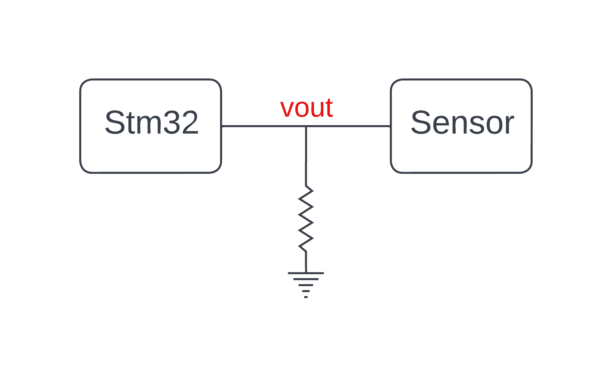

## Motor-car-driver
Overall description:
 For the hardware part of this project, we use stm32 nucleoboard as the interface that connects the controlling system with the hardware components of the car such as motor drivers and rotary encoders for speed capturing.

**Sending command to stm32 board:**
 To control the car, the controlling system (in this case the cellphone device) sends a command through USB type C port, the command then passes through USB OTG type C converter and CH34 to match with UART protocol, the stm32 board receives the comming UART signal then parses it to get the speed value and the spinning direction of each motor. We also use PWM signals to update the motor speed accordingly.

 The driving command has the following syntax: **!drv(sp1:sp2:sp3:sp4)#**

  Where sp1, sp2, sp3, sp4 are there-digit numbers ranging from 0 to 199. These numbers contains information about the speed and the spinning direction of each wheel. For these numbers, if their value is less than 100 then the spinning direction is clockwise, it is counter clockwise otherwise.
 
 **Speed capturing mechanism:**
  On the hardware implementation, there are 4 rotary encoders, each is responsible for one of the 4 wheels, a Disc with holes is equipped on the motor shaft of each wheel, the picture below illustrates the configuration of the rotary encoder and the disc.
  
 

  The rotary encoder uses the photoelectric technology to detect the motor spinning motion. At one end of the red region, there is a light source which can be detected by a light sensor placed on the other end. Because the disc is placed between the light source and the sensor, it might block the sensor from detecting the light source if no hole exists in between and viceversa. A pinnout, namely **"Vout"** is used to signal whether the sensor detects light from source or not in real time.
  
  The **"Vout"** pin of the sensor is connected to stm32 nucleo board as illustrated in the figure below:

 

  **The pulldown resistor is to assure the signal is low when the sensor fails to detect the ligh source.**
  

To calculate the motor's spinning speed, **Vout** port is connected to an external interrupt pin, as illstrated in the following code:

      void HAL_GPIO_EXTI_Callback(uint16_t GPIO_Pin)
      {
          switch(GPIO_Pin)
          {

             case GPIO_PIN_0:
             {
              counter[0]++;
              break;
             }
             case GPIO_PIN_2:
             {
              counter[1]++;
              break;
             }
             case GPIO_PIN_4:
             {
              counter[2]++;
              break;
             }
             case GPIO_PIN_6:
             {
              counter[3]++;
              break;
             }
             default:
              break;

         }

     }

Because we have 4 wheels, hence, we need up to 4 external interrupt pins instead of 1. As shown in the code, every time an external interrupt pin goes form low to high the corresponding element in the **counter** array gets incremented. About how fast the count variable increases is in fact relative to how fast the wheel is spinning, this can be measured by using a timer, which will interrupt the system every 100 ms, the value of each counter's element is proprtional to the speed of the wheel, this value is sent to the controlling system via UART protocl, the counter's elements are assigned to 0 at every 100 ms.

    

