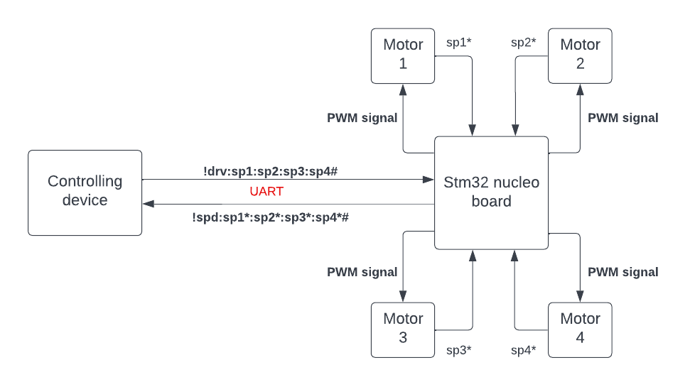

# Motor-car-driver
General description:
- In this project, I use stm32 board to implement the driving system. The figure below shows the general operation of the system:

- The  command has the following syntax: **!drv:sp1:sp2:sp3:sp4#**.

Where variables sp1, sp2, sp3, sp4 are three-digits numbers ranging from 000 to 199. The first two least significant digits in all four variables indicate the wheel spinning speed ranging from 0 to 99. The third digit is to show the spinning direction with 0 is to spin clock wise and 1 is to spin counter clock wise.

- The system also collects speed feedbacks of four motors by using rotary encoders, the speeds are periodically updated and sent to the controlling devices with the help of UART and DMA.
