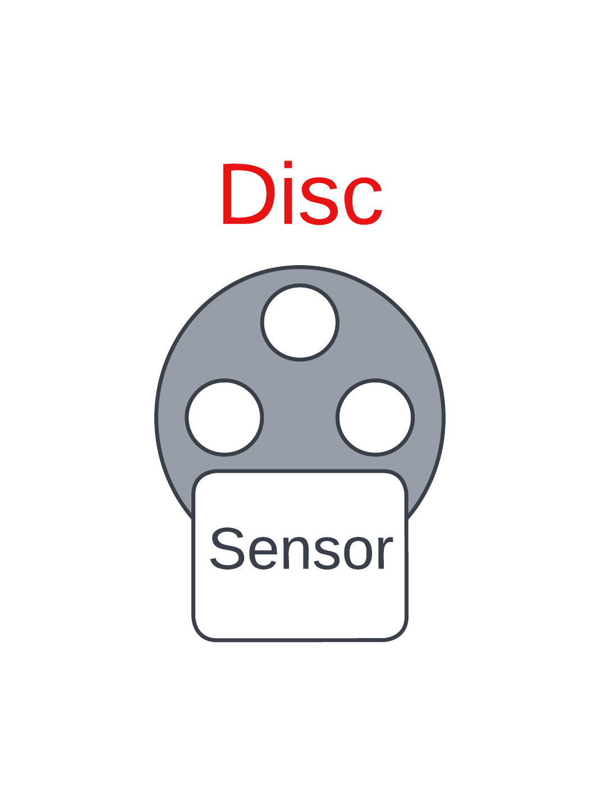

## Motor-car-driver
Overall description:
 For the hardware part of this project, we use stm32 nucleoboard as the interface that connects the controlling system with the hardware components of the car such as motor drivers and rotary encoders for speed capturing.

**Sending command to stm32 board:**
 To control the car, the controlling system (in this case the cellphone device) sends a command through USB type C port, the command then passes through USB OTG type C converter and CH34 to match with UART protocol, the stm32 board receives the comming UART signal then parses it to get the speed value and the spinning direction of each motor. We also use PWM signals to update the motor speed accordingly.

 The driving command has the following syntax: **!drv(sp1:sp2:sp3:sp4)#**

 Where sp1, sp2, sp3, sp4 are there-digit numbers ranging from 0 to 199. These numbers contains information about the speed and the spinning direction of each wheel. For these numbers, if their value is less than 100 then the spinning direction is clockwise, it is counter clockwise otherwise.
 
 **Speed capturing mechanism:**
  On the hardware implementation, there are 4 rotary encoders, each is responsible for one of the 4 wheels, a Disc with holes is equipped on the motor shaft of each wheel, the picture below illustrates the configuration of the rotary encoder and the disc.
  
 

